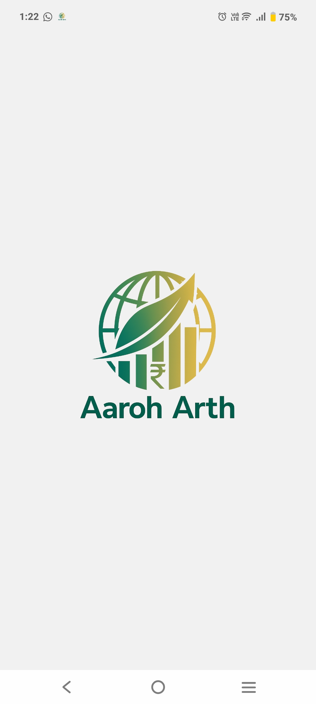
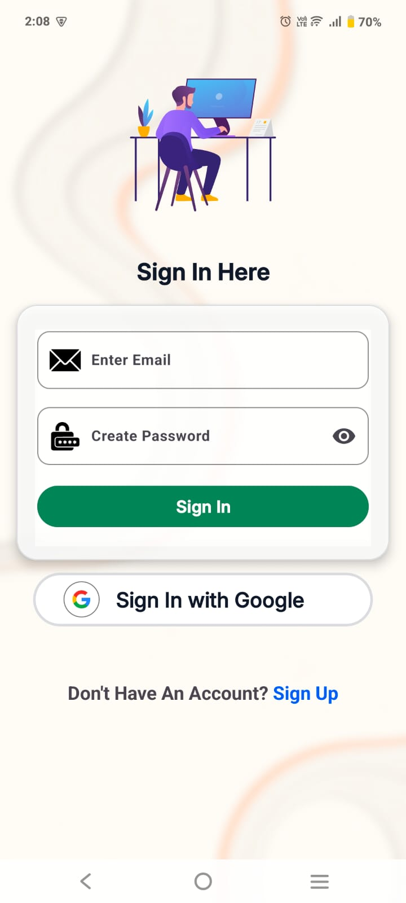
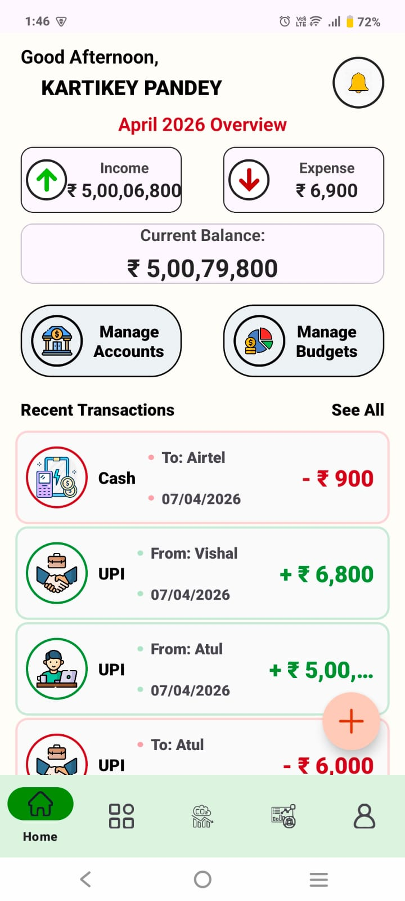
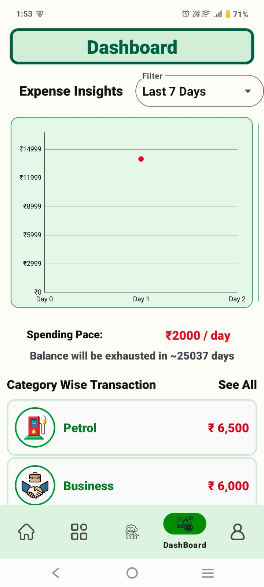
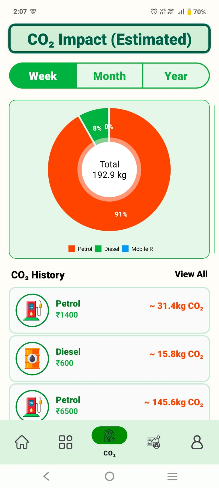
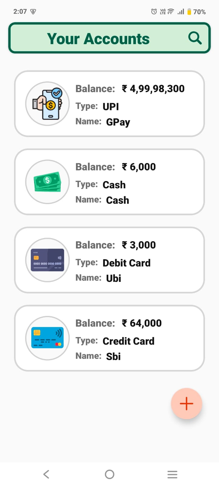
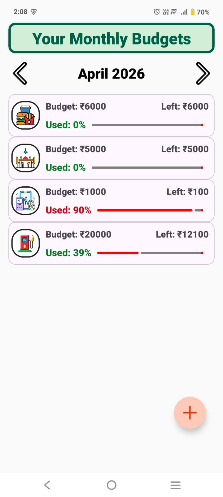
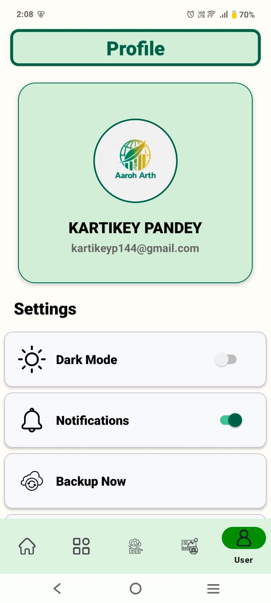

<div align="center">


# Aaroh Arth

### ${\color{goldenrod}Prospering\ You,\ Prospering\ Earth}$

</div>

---

> An offline-first personal finance management system for Android — combining transactional accounting, budget intelligence, and a carbon footprint estimation engine in a single MVVM-architected application.

---

## Badges


---

## Problem Statement

Most personal finance applications available to Indian users suffer from one or more of the following structural limitations:

- **Network dependency** — core functionality degrades or becomes unavailable without an internet connection, making them unreliable in low-connectivity environments.
- **Lack of environmental context** — financial behavior has a measurable carbon footprint, yet no mainstream budgeting tool surfaces this data alongside spending analytics.
- **Fragmented account management** — users operating across bank accounts, UPI wallets, debit cards, and cash rarely have a unified view of their financial position.
- **Shallow analytics** — most apps report raw totals rather than predictive or trend-based insights.

AarohArth addresses this gap by building a fully offline-capable accounting core with Room as the authoritative data layer, layering optional Firestore cloud synchronization on top, and embedding a category-mapped carbon estimation engine that translates everyday financial transactions into estimated CO₂ contributions — providing users with both financial and environmental accountability from a single interface.

---

## Feature Modules

### Transaction Engine
- Add, edit, and delete income and expense transactions with full lifecycle management
- Category classification system for semantic grouping of financial activity
- Automatic balance recalculation propagated across affected accounts on every write operation

### Multi-Account System
- Supports bank accounts, UPI-linked accounts, debit cards, and physical cash wallets
- Account-level balance tracking with real-time aggregation
- Unified net-worth view across all account types

### Budget Tracking Module
- Monthly budget allocation per spending category
- Usage percentage monitoring with threshold-aware status indicators
- Budget state persisted locally and synced on demand

### Analytics Dashboard
- Spending pace prediction based on current period consumption rate
- Category-wise breakdown with time-range filtering: 7-day, 30-day, and 365-day windows
- Chart-based visualization of spending distribution and trends over time

### Carbon Footprint Estimation Engine
- Expense categories mapped to domain-specific CO₂ emission factors
- Per-transaction carbon contribution calculated and aggregated
- Visualization dashboards for weekly, monthly, and yearly carbon output
- Surfaces environmental cost of financial behavior without requiring user input beyond standard transaction entry

### Offline-First Persistence & Sync
- Room database operates as the single source of truth for all transactional, account, and budget data
- Firebase Firestore used as an optional asynchronous sync layer — not a dependency for core functionality
- Application remains fully functional with no network connectivity

### Backup and Restore System
- Cloud backup capability for user data via Firestore
- Restore functionality to recover data across device resets or reinstalls

### Authentication
- Email/password authentication via Firebase Authentication
- Google Sign-In integration for streamlined onboarding

### Profile and Settings
- Dark mode toggle with persistent preference storage
- Notification toggle
- Backup and Restore access controls within the profile screen

---

## Architecture

AarohArth is structured around the **MVVM (Model-View-ViewModel)** pattern with a **Repository abstraction layer**, following Android's recommended app architecture guidelines.

```
UI Layer (Fragment / Activity)
        │
        ▼
ViewModel Layer
  - Exposes StateFlow / LiveData to the UI
  - Contains UI business logic
  - Delegates all data operations to the Repository
        │
        ▼
Repository Layer
  - Single entry point for all data access
  - Decides whether to serve from local (Room) or remote (Firestore)
  - Abstracts the data source entirely from the ViewModel
        │
        ├──────────────────────┐
        ▼                      ▼
Room Database (Local)    Firebase Firestore (Remote)
  - Source of truth         - Optional sync layer
  - Always written first    - Written after local commit
```

**Key design decisions:**

- **ViewModels** hold no direct references to Android framework components, enabling safe configuration change survival and straightforward unit testing.
- **Repositories** encapsulate all read/write logic, including the local-first write strategy: every mutation is committed to Room before any Firestore sync is attempted.
- **StateFlow** is used for reactive UI state propagation, replacing LiveData where lifecycle-awareness is not required.
- **Room DAOs** are exposed as Flow-returning interfaces, enabling the UI to observe database changes reactively without polling.

---

## Offline-First Data Strategy

AarohArth treats network availability as optional, not assumed. The data strategy is implemented as follows:

1. **All writes go to Room first.** No transaction, account update, or budget change is considered committed until it is persisted locally.
2. **Firestore sync is initiated after local commit.** If the device is offline, sync is deferred — the local database remains consistent and usable regardless.
3. **Room is the read source for all UI state.** The UI never reads directly from Firestore. All displayed data is derived from Room queries exposed as reactive Flows.
4. **Firestore serves backup and cross-device restore**, not real-time data delivery. This eliminates dependency on network latency for any user-facing operation.

This approach ensures that the application maintains full functionality in airplane mode, low-bandwidth environments, or during Firebase service interruptions.

---

## Tech Stack

| Layer | Technology |
|---|---|
| Language | Kotlin |
| UI | XML Layouts, View Binding |
| Architecture | MVVM + Repository Pattern |
| Local Persistence | Room Database |
| Remote Sync | Firebase Firestore |
| Authentication | Firebase Authentication |
| Reactive State | StateFlow / LiveData |
| Build System | Gradle (Kotlin DSL) |
| Minimum SDK | Android 8.0 (API 26) |

---

## Screenshots

<div align="center">

### Splash Screen


### Login


### Home


### Analytics Dashboard


### CO₂ Impact Estimator


### Accounts


### Monthly Budget


### Profile & Backup


</div>

---

## Installation

### Option 1 — Install via APK

1. Download the latest APK from the [Releases](../../releases) page.
2. On your Android device, enable **Install from Unknown Sources** under `Settings → Security`.
3. Open the downloaded `.apk` file and follow the installation prompts.

### Option 2 — Build from Source

**Prerequisites:**
- Android Studio Hedgehog (2023.1.1) or later
- JDK 17
- Android SDK with API Level 26+

**Steps:**

```bash
# Clone the repository
git clone https://github.com/kartikeypandey/AarohArth.git

# Open the project in Android Studio
# File → Open → select the cloned directory

# Add your google-services.json
# Place your Firebase project's google-services.json in /app/
```

> Configure Firebase: Create a Firebase project, enable Authentication (Email + Google), and Firestore. Download `google-services.json` and place it in the `app/` directory.

```bash
# Build and run
# Use the Run button in Android Studio, or:
./gradlew assembleDebug
```

---

## Project Structure

```
AarohArth/
├── app/
│   ├── src/main/
│   │   ├── java/com/kartikey/aarohArth/
│   │   │   ├── data/
│   │   │   │   ├── local/              # Room database, DAOs, entities
│   │   │   │   ├── remote/             # Firestore data sources
│   │   │   │   └── repository/         # Repository implementations
│   │   │   ├── domain/
│   │   │   │   ├── model/              # Domain model classes
│   │   │   │   └── usecase/            # Business logic encapsulation
│   │   │   ├── ui/
│   │   │   │   ├── dashboard/          # Analytics dashboard fragment + ViewModel
│   │   │   │   ├── transactions/       # Transaction list, add/edit screens
│   │   │   │   ├── accounts/           # Multi-account management
│   │   │   │   ├── budget/             # Budget allocation and tracking
│   │   │   │   ├── carbon/             # Carbon footprint estimation screens
│   │   │   │   ├── auth/               # Login, registration flows
│   │   │   │   └── profile/            # Settings, backup, dark mode
│   │   │   └── util/                   # Extension functions, constants, helpers
│   │   └── res/
│   │       ├── layout/                 # XML layout files
│   │       ├── drawable/               # Icons and vector assets
│   │       └── values/                 # Themes, strings, dimensions
│   └── google-services.json            # Firebase config (not committed — add manually)
├── screenshots/                        # App screenshots for README
│   ├── logo.png
│   ├── splash.png
│   ├── login.png
│   ├── home.png
│   ├── dashboard.png
│   ├── carbon.png
│   ├── accounts.png
│   ├── budget.png
│   └── profile.png
├── build.gradle.kts
├── settings.gradle.kts
└── README.md
```

---

## Engineering Highlights

### Offline-First Architecture
The application is designed such that the Room database is never bypassed. Every data operation — regardless of network state — resolves locally first. This is not a fallback mechanism; it is the primary data flow. Firestore sync is treated as an eventual-consistency side effect, not a prerequisite for data integrity.

### Reactive Balance Recalculation Pipeline
Account balances are not stored as static fields that require manual update calls. Instead, balance values are derived reactively from the transaction log via Room's Flow-based queries. Any insert, update, or delete operation on the transactions table triggers downstream recomputation of affected account balances, which propagates automatically to all active observers in the UI layer. This eliminates an entire class of stale-state bugs common in imperative update patterns.

### Repository Abstraction Layer
The Repository pattern is enforced as a hard boundary between the ViewModel layer and any data source. ViewModels have no awareness of whether data originates from Room or Firestore — they interact solely with repository interfaces. This decoupling means data source implementations can be swapped, mocked for testing, or extended (e.g., adding a REST API layer) without modifying any ViewModel or UI code.

### Firestore Sync Strategy
Firestore is integrated as an asynchronous, non-blocking sync layer. The sync flow operates as follows: local Room write completes → coroutine dispatches a Firestore write in the background → failure is handled silently with retry eligibility. Firestore is never in the read path for UI state. This strategy keeps the UI responsive and consistent regardless of Firestore availability.

### Carbon Estimation Logic Pipeline
Each transaction carries a category tag that maps to a predefined emission factor table. On transaction commit, the carbon module computes an estimated CO₂ contribution using the transaction amount and the category's emission coefficient. These per-transaction values are aggregated by time window (weekly, monthly, yearly) and surfaced through a dedicated visualization dashboard. The pipeline runs entirely offline with no external API dependency.

---

## Carbon Estimation Engine

The carbon footprint module operates as a self-contained estimation subsystem embedded within the transaction processing pipeline.

**Category Mapping**
Each expense category (e.g., Food, Transport, Utilities, Shopping) is mapped to a corresponding emission factor expressed in kg CO₂ per unit of spend. These mappings are stored as static configuration within the application.

**Emission Factor Application**
On each transaction write, the engine retrieves the emission factor for the transaction's category and computes:

```
Estimated CO₂ (kg) = Transaction Amount × Emission Factor (kg CO₂ / currency unit)
```

This produces a per-transaction carbon estimate that is persisted alongside the transaction record in Room.

**Time-Range Aggregation**
Carbon data is aggregated across configurable time windows — 7 days, 30 days, and 365 days — using Room queries that group and sum estimates by date range. These aggregated values are fed directly into the visualization layer.

**Chart Visualization**
Aggregated carbon data is rendered as time-series and category-distribution charts within the carbon dashboard, providing users with a visual representation of how their spending patterns translate to environmental impact over time.

**Note on Accuracy**
Emission factors used are static approximations based on general-purpose consumption research. This engine is designed to provide indicative estimates for behavioral awareness, not certified carbon accounting.

---

## Limitations

- **No conflict-safe multi-device sync** — the current Firestore sync strategy uses a last-write-wins approach. Concurrent edits from multiple devices are not resolved through conflict detection and may result in data loss.
- **No recurring transaction automation** — the application does not support scheduled or automatically repeating transactions (e.g., monthly subscriptions or salary credits). All transactions require manual entry.
- **Static emission factors** — carbon estimation uses fixed emission coefficients that do not adapt to regional energy grids, seasonal variation, or user-specific consumption patterns.

---

## Future Improvements

- **Biometric authentication** — integrate Android BiometricPrompt API for fingerprint and face-based app lock.
- **CSV export** — allow users to export transaction history and carbon reports as CSV files for use in external tools.
- **Recurring transactions engine** — build a background-scheduled transaction system with configurable frequency, amount, and category for automated bookkeeping.
- **Conflict-aware sync strategy** — implement a versioned document model in Firestore with server-side timestamps to enable deterministic conflict resolution across devices.
- **Advanced analytics insights** — extend the analytics module with anomaly detection, month-over-month variance analysis, and predictive budget exhaustion forecasting.

---

## Team

AarohArth was collaboratively designed and developed by a team of three.

| Name | GitHub |
|---|---|
| Kartikey Pandey | [@kartikeypandey](https://github.com/kartikeypandey) |
| Atul Kumar | [@A-t-u-l-K-u-m-a-r](https://github.com/A-t-u-l-K-u-m-a-r) |
| Vishal Kumar Bharti | [@vitaly4321](https://github.com/vitaly4321) |

---

*AarohArth is a portfolio project demonstrating production-oriented Android engineering practices including offline-first architecture, reactive data pipelines, and multi-source persistence strategies.*
